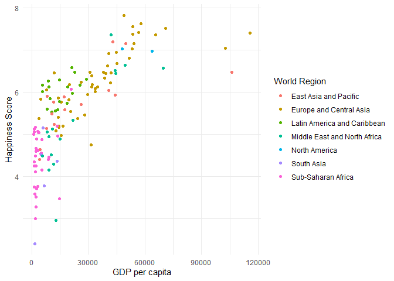
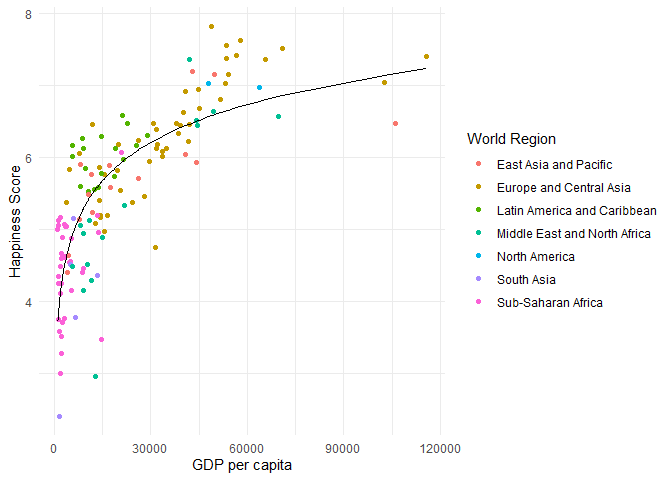

Does money buy happiness?
================
Leilane Cambara
2024-03-15

## Introduction

This is an old question and you already probably thought about it at
some point in your life, finding your own answer for it. In the past
decade, there has been an increasing effort to make happiness a variable
to be taken into account in government policymaking. The World Happiness
Report, which polls people around the world about their lives, resulting
in the Happiness Score, is a reflection of this.

In a [dashboard in Tableau
Public](https://public.tableau.com/app/profile/leilane.cambara/viz/Doesmoneybuyhappiness_17107642856590/MoneyandHappiness),
I created a visualisation to explore the relationship between the
Happiness Score and GDP per capita to try to answer the question.

*The GDP per capita is the Gross Domestic Product (GDP) per person in an
economy and the GDP, in simple terms, is the monetary value of how much
a country produced within its borders in a certain period. It is the
main variable used to evaluate the state of an economy.*

In this short report, I analyse the data and fit a model to it.

## Descriptive statistics

The Happiness Score comes from the [World Happiness
Report](https://worldhappiness.report/) and the GDP per capita comes
from [Our World in Data and the World
Bank](https://ourworldindata.org/grapher/gdp-per-capita-worldbank). In
order to be able to also explore potential regional differences, I group
the countries by world regions as categorised by the World Bank,
collected from [Our World in
Data](https://ourworldindata.org/grapher/world-regions-according-to-the-world-bank).

I merge the data sets using an inner join, such that I keep only the
countries with records in all tables. This results in a sample of 138
countries, with the following distribution by regions:

| World Region                 | Countries |
|:-----------------------------|----------:|
| East Asia and Pacific        |        15 |
| Europe and Central Asia      |        48 |
| Latin America and Caribbean  |        18 |
| Middle East and North Africa |        15 |
| North America                |         2 |
| South Asia                   |         6 |
| Sub-Saharan Africa           |        34 |

Number of countries per region

Europe and Central Asia is the region with the most number of countries
(48), followed by the Sub-Saharan Africa (34). North America is the
region with the least number of countries, with only two: United States
and Canada. Even though Mexico is geographically located in North
America, it is culturally a Latin American country, such that it is
included in the Latin America and Caribbean region.

The Happiness Score, by construction, is a number that ranges from zero
to ten, while the GDP per capita is expressed in international dollars
at 2017 prices and can be any positive number.

In 2022, the average of the Happiness Score around the world was 5.56,
just above 50%, with a standard deviation of 1.11. The countries who had
the minimum and maximum Happiness Score, or in other words the happiest
country and the least happy country in the world were Finland (score of
7.82) and Afghanistan (score of 2.4).

The average GDP per capita in 2022 was 2263.43 international dollars,
with a standard deviation of 22013.07. The highest GDP per capita
(115683.49, produced by Luxembourg) was almost 100 times higher than the
lowest one (1186.58, produced by Niger).

|                 |     Mean |    Min. |      Max. | St. dev. |
|:----------------|---------:|--------:|----------:|---------:|
| Happiness Score |     5.56 |    2.40 |      7.82 |     1.11 |
| GDP per capita  | 22263.43 | 1186.58 | 115683.49 | 22013.07 |

Descriptive statistics of the Happiness Score and GDP per capita

Analysing the Happiness Score by region, we see that North America was
the happiest region in 2022, with a score of 7: 7.03 for Canada and 6.98
for the United States. As it was classified, North America is an
homogeneous region, which reflects in similar Happiness Scores. South
Asia, on the other hand, which includes the least happy country in the
world (Afghanistan) was the least happy region, with an average score of
4.27. The happiest country in the region, Nepal, only scored 5.38.
Middle East and North Africa is the region with the highest standard
deviation and widest Happiness Score range: Lebanon scored the minimum
of 2.96 and Israel the maximum of 7.36. The region’s average score was
5.29. After North America, which only includes two countries, Latin
America and Caribbean, which had an average score of 6.01, is the region
with the smallest standard deviation (0.32) and range in the score:
Costa Rica was the happiest country with 6.58 and Ecuador was the least
happy with 5.53.

| World Region                 | Mean | Min. | Max. | St. dev. |
|:-----------------------------|-----:|-----:|-----:|---------:|
| East Asia and Pacific        | 5.77 | 4.39 | 7.20 |     0.78 |
| Europe and Central Asia      | 6.30 | 4.74 | 7.82 |     0.79 |
| Latin America and Caribbean  | 6.01 | 5.53 | 6.58 |     0.32 |
| Middle East and North Africa | 5.29 | 2.96 | 7.36 |     1.20 |
| North America                | 7.00 | 6.98 | 7.03 |     0.03 |
| South Asia                   | 4.27 | 2.40 | 5.38 |     1.08 |
| Sub-Saharan Africa           | 4.46 | 3.00 | 6.07 |     0.67 |

Descriptive statistics of the Happiness Score by world region

| World Region                 |     Mean |     Min. |      Max. | St. dev. |
|:-----------------------------|---------:|---------:|----------:|---------:|
| East Asia and Pacific        | 26882.34 |  4032.63 | 106032.23 | 26977.46 |
| Europe and Central Asia      | 36021.48 |  3903.32 | 115683.49 | 22577.67 |
| Latin America and Caribbean  | 15039.49 |  5572.18 |  29037.94 |  6990.52 |
| Middle East and North Africa | 24334.56 |  5643.07 |  69733.80 | 20090.58 |
| North America                | 55781.33 | 47892.94 |  63669.71 | 11155.86 |
| South Asia                   |  6078.36 |  1516.31 |  13386.68 |  4006.95 |
| Sub-Saharan Africa           |  4597.80 |  1186.58 |  20967.95 |  4653.80 |

Descriptive statistics of the GDP per capita by world region

## The relationship between money (GDP per capita) and happiness

There is a moderate positive correlation (which is linear) between GDP
per capita and happiness, of around 0.75, but the scatter plot suggests
there is a nonlinear relationship between them.

<!-- -->

## Fitting a model

It looks like a logarithmic model could be a good candidate to fit the
data. Hence, in what follows, I fit the data to:

$Happiness\_Score = \beta_0 + \beta_1\ln(GDP\_per\_capita) + \epsilon$,

where $\beta_0$ is the intercept, $\beta_1$ is the coefficient for the
effect of the natural logarithm of GDP per capita on the Happiness
Score, and $\epsilon$ is an error term.

    ## 
    ## Call:
    ## lm(formula = unlist(df["Happiness_score"]) ~ log(unlist(df["GDP_per_capita"])))
    ## 
    ## Residuals:
    ##      Min       1Q   Median       3Q      Max 
    ## -2.60793 -0.36595  0.02777  0.45745  1.29552 
    ## 
    ## Coefficients:
    ##                                   Estimate Std. Error t value Pr(>|t|)    
    ## (Intercept)                       -1.70598    0.47924   -3.56 0.000512 ***
    ## log(unlist(df["GDP_per_capita"]))  0.76753    0.05025   15.27  < 2e-16 ***
    ## ---
    ## Signif. codes:  0 '***' 0.001 '**' 0.01 '*' 0.05 '.' 0.1 ' ' 1
    ## 
    ## Residual standard error: 0.6738 on 136 degrees of freedom
    ## Multiple R-squared:  0.6317, Adjusted R-squared:  0.629 
    ## F-statistic: 233.3 on 1 and 136 DF,  p-value: < 2.2e-16

The result implies that the relationship between the variables is given
by:

$Happiness\_Score = -1.7060 + 0.7675\ln(GDP\_per\_capita) + \epsilon$,

such that, for a country with a GDP per capita of 44,979 (the UK), we
would predict a Happiness Score of 6.5170, while the actual was 6.9430.
The scatter plot with the predicted line shows that the logarithmic
model is a decent approximation, even though it might not be the best.

<!-- -->
